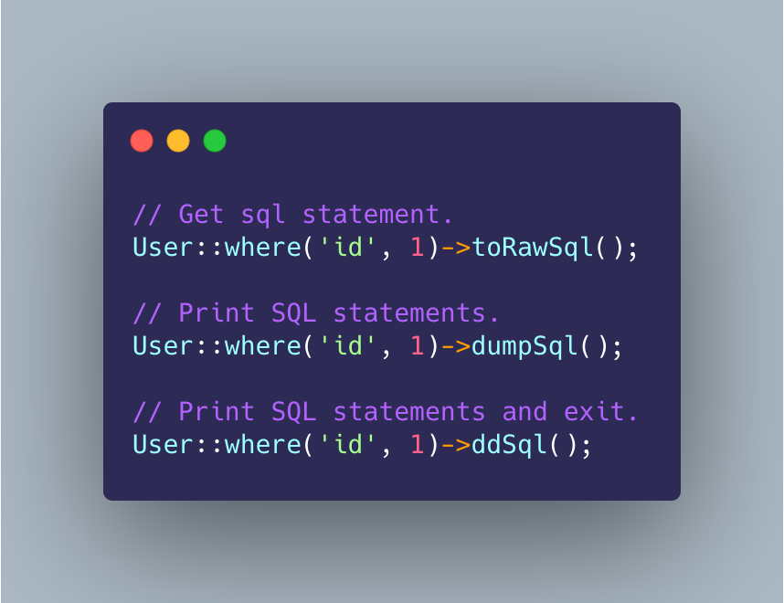

# laravel-raw-sql

> Easy output of SQL statements for laravel framework.

<p align="center"></p>


[](//packagist.org/packages/guanguans/laravel-raw-sql)
[](//packagist.org/packages/guanguans/laravel-raw-sql)
[](//packagist.org/packages/guanguans/laravel-raw-sql)

## Installing

``` shell
$ composer require guanguans/laravel-raw-sql -v
```

### Publish

```php
$ php artisan vendor:publish --provider="Guanguans\\LaravelRawSql\\ServiceProvider"
```

> Custom method name. `config/rawsql.php`

## Usage

``` php
// Get sql statement.
User::where('id', 1)->toRawSql();
DB::table('user')->where('id', 1)->toRawSql();

// Print SQL statements.
User::where('id', 1)->dumpRawSql();
DB::table('user')->where('id', 1)->dumpRawSql();

// Print SQL statements and exit.
User::where('id', 1)->ddRawSql();
DB::table('user')->where('id', 1)->ddRawSql();
```

## Testing

``` shell
$ composer test
```

## License

[MIT](LICENSE)
