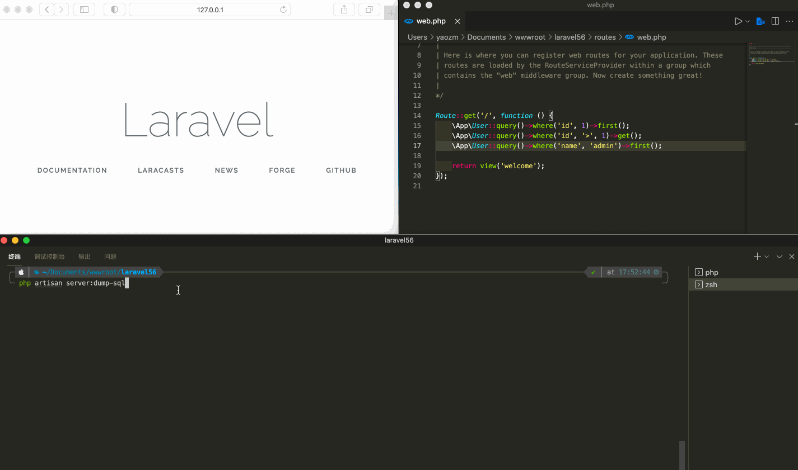
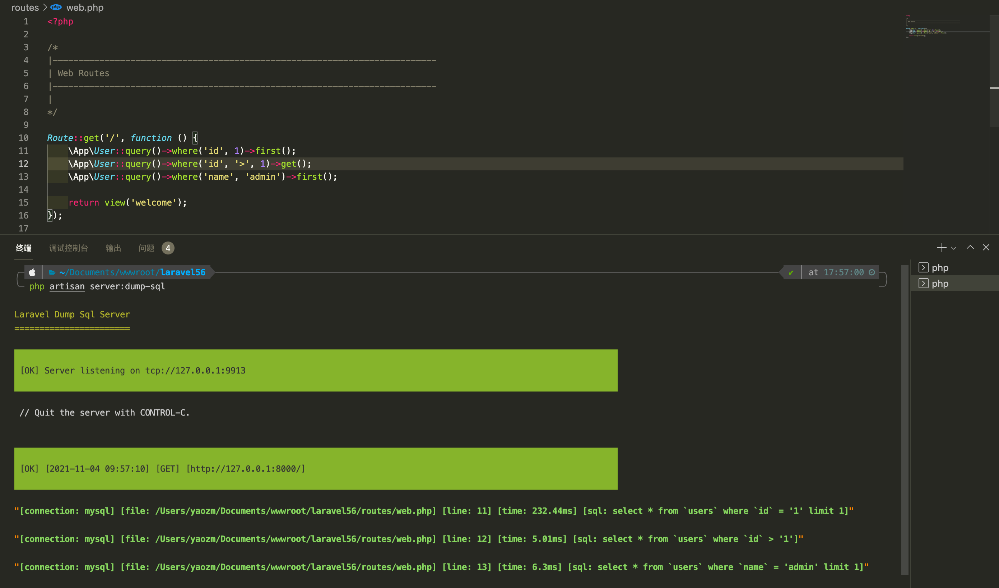

# laravel-dump-sql



[](https://github.com/guanguans/laravel-dump-sql/actions)
[](https://github.com/guanguans/laravel-dump-sql/actions)
[](https://codecov.io/gh/guanguans/laravel-dump-sql)
[](//packagist.org/packages/guanguans/laravel-dump-sql)
[](//packagist.org/packages/guanguans/laravel-dump-sql)
[](//packagist.org/packages/guanguans/laravel-dump-sql)

> Assist laravel application to obtain complete sql statement. - 辅助 laravel 应用获取完整的 sql 语句。

> The sql statement obtained by the query construction method in laravel is not bound to the conditional parameters, similar to `select * from users where id= ?`. This expansion pack can help you get a complete sql statement. - laravel 中查询构造方法得到的 sql 语句没有绑定条件参数，类似于`select * from users where id= ?`。这个扩展包可辅助你获取完整的 sql 语句。

## 功能

* 添加获取 sql 语句的查询构建便捷方法(`toRawSql`、`dumpSql`、`ddSql`、`logListenedSql`、`dumpListenedSql`、`ddListenedSql`)
* 添加监控 sql 语句的服务命令

## 环境要求

* laravel || lumen >= 6.10

## 安装

```shell
$ composer require guanguans/laravel-dump-sql -v
```

### lumen 中配置(laravel 中请忽略)

将下面代码添加到 `bootstrap/app.php` 文件中的 `Register Service Providers` 部分

```php
$app->register(\Guanguans\LaravelDumpSql\ServiceProvider::class);
```

## 使用

### 监控 sql 语句的服务的使用

```shell
$ php artisan server:dump-sql
```



### 获取 sql 语句的查询构建便捷方法的使用

安装配置完毕后数据库查询构造方法会新增以下几个方法：

* toRawSql() - 获取完整的 sql
* dumpSql() - 打印完整的 sql
* ddSql() - 打印完整的 sql 并且退出
* logListenedSql() - 记录被监听到的 sql
* dumpListenedSql() - 打印被监听到的 sql
* ddListenedSql() - 打印被监听到的 sql 并且退出

#### toRawSql() - 获取完整的 sql

```php
$sql = User::query()->where('id', 1)->toRawSql();
dd($sql);
```

```sql
"select * from `xb_users` where `id` = 1"
```

#### dumpSql() - 打印完整的 sql

```php
User::query()->where('id', 1)->dumpSql();
User::query()->where('id', 2)->dumpSql();
```

```sql
"select * from `xb_users` where `id` = 1"
"select * from `xb_users` where `id` = 2"
```

#### ddSql() - 打印完整的 sql 并且退出

```php
User::query()->where('id', 1)->ddSql();
User::query()->where('id', 2)->ddSql();
```

```sql
"select * from `xb_users` where `id` = 1"
```

#### logListenedSql() - 记录被监听到的 sql

```php
User::query()->where('id', 1)->logListenedSql()->first();
User::query()->where('id', 2)->first();
```

```shell
# 日志中
[Laravel] [39.97ms] select * from `xb_users` where `id` = '1' limit 1 | GET: /
[Laravel] [39.93ms] select * from `xb_users` where `id` = '2' limit 1 | GET: /
```

#### dumpListenedSql() - 打印被监听到的 sql

```php
User::query()->where('id', 1)->dumpListenedSql()->first();
User::query()->where('id', 2)->first();
```

```shell
[Laravel] [39.97ms] select * from `xb_users` where `id` = '1' limit 1 | GET: /
[Laravel] [39.93ms] select * from `xb_users` where `id` = '2' limit 1 | GET: /
```

#### ddListenedSql() - 打印被监听到的 sql 并且退出

```php
User::query()->where('id', 1)->ddListenedSql()->first();
User::query()->where('id', 2)->first();
```

```shell
[Laravel] [39.97ms] select * from `xb_users` where `id` = '1' limit 1 | GET: /
```

## 安全漏洞

请查看[我们的安全政策](../../security/policy)了解如何报告安全漏洞。

## 贡献者

* [guanguans](https://github.com/guanguans)
* [所有贡献者](../../contributors)

## 协议

MIT 许可证（MIT）。有关更多信息，请参见[协议文件](LICENSE)。
